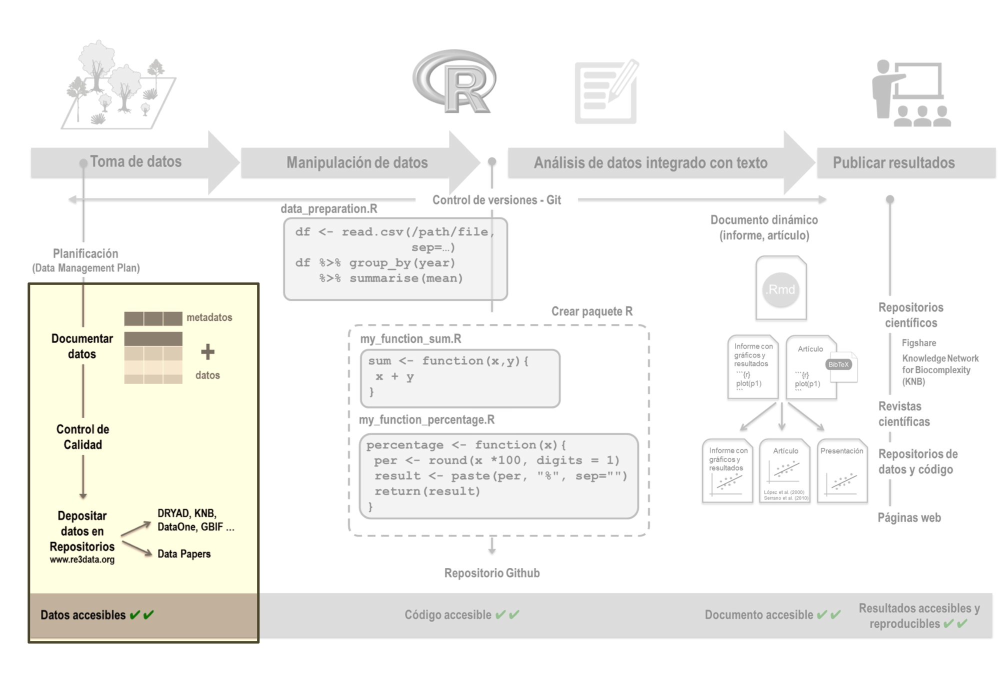
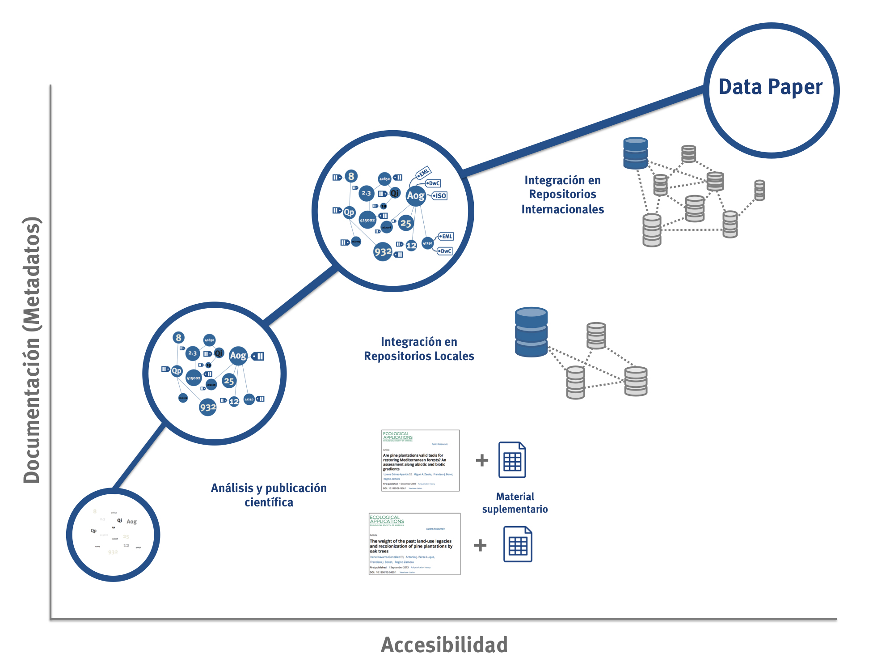
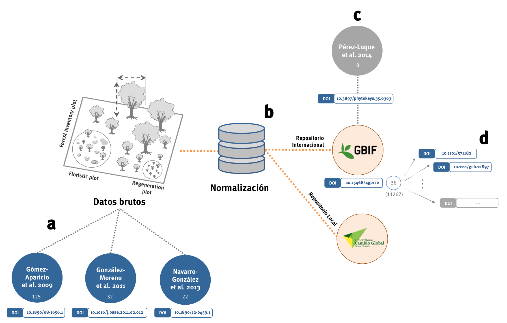

> (1) Laboratorio de Ecología, Instituto Interuniversitario de Investigación del Sistema Tierra (IISTA-CEAMA), Universidad de Granada, Avda. del Mediterráneo s/n, Granada 18006, España.

> (2) Grupo de Ecología Terrestre, Departamento de Ecología, Universidad de Granada, Facultad de Ciencias, Campus Fuentenueva s/n, 18071, Granada, España

> Autor para correspondencia: A. J. Pérez-Luque [ajperez@ugr.es]

> (a) [https://orcid.org/0000-0002-1747-0469](https://orcid.org/0000-0002-1747-0469)
> (b) [https://orcid.org/0000-0001-9535-6541](https://orcid.org/0000-0001-9535-6541)

# Palabras clave

> publicación de datos; repositorios de datos; data papers; metadatos; principios FAIR


# Keywords

> data publishing; data repository; data papers; metadata; FAIR principles


```{r knitcitations, echo=FALSE, cache = FALSE}
library(knitcitations)
cleanbib()   
cite_options(citation_format = "pandoc")
```

# Resumen
Los datos constituyen uno de los productos valiosos de la ciencia. Su preservación, accesibilidad y reutilización en ecología resulta crucial, teniendo en cuenta la importancia de las series de datos para comprender patrones ecológicos complejos y/o resolver problemas ambientales emergentes. Aunque la mayoría de los investigadores reconocen la importancia de compartir datos, existen diferentes barreras sociales y tecnológicas que limitan la puesta en valor de los mismos, ralentizando posibles avances en la investigación ecológica. En este trabajo revisamos las distintas prácticas de publicación de datos en ecología y presentamos una serie de ideas para añadir “más” valor a los datos a través de su documentación y su publicación. Asimismo, presentamos un caso de estudio en el que mostramos diferentes aproximaciones a la hora de compartir datos. A lo largo de la revisión incluimos diferentes recursos y herramientas que nos ayuden a maximizar el valor de los datos que generamos y facilitar el acceso a los demás usuarios. 

# Abstract 
Data is one of the valuable products of science. Their preservation, accessibility and reuse in ecology is crucial, given the importance of data sets for understanding complex ecological questions and/or solving emerging environmental problems. Although most researchers recognize the importance of sharing data, there are different social and technological barriers that limit the value of data, slowing down possible advances in ecological research. In this paper we review the different practices of data publication in ecology and present a series of ideas to add "more" value to the data through their documentation and publication. We also present a case study showing different approaches to data sharing. Throughout the review we included different resources and tools to help us maximize the value of the data we generate and facilitate access to other users. 

# Introducción 

La ciencia puede concebirse como una empresa social cuya finalidad es la acumulación de conocimiento como bien público [@Munafo2017]. Uno de los productos de esta gran empresa son, sin duda, los datos. Podría incluso afirmarse que se trata de uno de sus productos más valiosos, teniendo en cuenta que constituyen la base para la generación de información y conocimiento científico [@Costello2013]. La existencia de series de datos a largo plazo permiten probar y desarrollar teorías, así como comprender patrones ecológicos y evolutivos complejos que a menudo surgen sólo en escalas de tiempo más largas [@Kuebbingetal2018LongtermResearch]. En la disciplina ecológica, el valor de la disponibilidad de los datos (open data) se ha reconocido más en algunos campos, como la genómica o la biogeografía; mientras que muchas investigaciones ecológicas aún no han conseguido incorporar plenamente la filosofía de hacer disponibles sus datos [@Culinaetal2018NavigatingUnfolding].  El tratamiento de grandes volúmenes de datos (Big Data), que no se manejan fácilmente con las herramientas y prácticas habituales, ofrece oportunidades sin precedentes para el avance científico, y puede servir para generar nuevo conocimiento útil para la toma de decisiones frente a problemas ambientales complejos [@Hamptonetal2013BigData; @LaDeauetal2017NextDecade].

En la transición hacia una ciencia abierta, la disponibilidad de los datos se perfila como un aspecto inherente a la reproducibilidad [@RodriguezSanchez2016], pues contribuye directa y positivamente a que un estudio científico sea más reproducible (Fig. 1).  Los beneficios de compartir datos están bien identificados y concretados [*e.g.* @Whitlock2011; @TorresSalinasetal2012CompartirDatos; @Hampton2015; @Soranno2019SixSimple] entre otros: 

* Mejor aprovechamiento de los recursos invertidos en ciencia, especialmente en los proyectos financiados con fondos públicos. 
* Realización de metaanálisis y posibilidad de resolver nuevas cuestiones. 
* Optimización de la financiación, evitando la duplicación de proyectos a obtener datos similares. 
* Reducción del riesgo de pérdida de los datos. 
* Aumento de la transparencia en ciencia, permitiendo la reproducibilidad de análisis y verificación de resultados. 
* Incremento en el crédito de los proveedores de datos. 

Sin embargo, se necesita una mejora en la eficiencia del uso de los datos, pensando no solo en el uso concreto para el cual se han adquirido los datos [@Hampton2015; @DiazDelgado2016InvestigacionSeguimiento].  En este sentido, en 2016 se llevó a cabo un esfuerzo por parte de la comunidad científica para establecer unos principios que permitan una gestión eficaz de los datos. Este marco de trabajo conocido como FAIR (*Findable*, *Accessible*, *Interoperable*, and *Reusable*) [@Wilkinson2016], ofrece una serie de recomendaciones para asegurar que los datos sean encontrables, accesibles, interoperables y reutilizables. Encontrables (*Findable*) se refiere a que los datos y los metadatos puedan ser descubiertos por la comunidad científica. Para ello se requiere que los datos y/o metadatos sean identificados de forma única y persistente, así como que estén indexados y descritos en detalle. Para que los datos sean accesibles (*Accessible*) una vez encontrados, es necesario que se publiquen utilizando protocolos estandarizados. La utilización de estándares de intercambio permite así que los datos sean interoperables (*Interoperable*). Por último, los datos deben de ser reutilizables (*Reusable*), asegurando que se conserva su procedencia así como las condiciones de reutilización.  En definitiva, los principios FAIR promueven que los datos, además de estar accesibles, estén bien documentados para poder reutilizarse, lo cual incrementará su valor original.

En este contexto, la puesta en valor de los datos cobra especial relevancia pues, actualmente, todavía muchos investigadores se encuentran con una baja accesibilidad al recurso ralentizando posibles avances en investigación ecológica [@Wolkovichetal2012AdvancesGlobal]. ¿Qué medidas concretas podemos adoptar para maximizar el valor de los datos que generamos y facilitar el acceso a los demás usuarios?. En este trabajo revisamos algunas de las prácticas de publicación de datos en ecología y  presentamos algunas ideas para añadir “más” valor a los datos a través de su documentación (metadatado) [@Fegraus2005] y su publicación [@Costello2013] como data papers [@Chavan2011]. 

# La publicación de datos: más allá del material suplementario
En los trabajos científicos, los conjuntos de datos suponen el punto de partida para la realización de análisis y la obtención de resultados, sin embargo, aún prevalece la idea equivocada de que un proyecto de investigación finaliza cuando se escribe y publica un artículo científico [@Goodman2014], dejando en segundo plano el *qué hacer* con los datos originales y su relevancia para la reproducibilidad del estudio. Lo cierto es que la gran mayoría de los estudios científicos no son reproducibles y, en ocasiones, incluso la trazabilidad de los resultados es un misterio para los propios autores [@RodriguezSanchez2016]. Una deficiente documentación y disponibilidad de los datos en las publicaciones científicas obstaculiza la evaluación crítica de sus resultados [@Goodman2014]. Ante esta situación, incluir los datos como material suplementario de un artículo resulta insuficiente por diversas razones. A modo general, porque la información queda huérfana al no integrarse con el resto de datasets que sustentan el conocimiento científico sobre un tema, dificultando su descubrimiento [@Michener2015]; y a efectos prácticos, porque no puede garantizarse la disponibilidad de los datos a largo plazo, quedando expuestos al devenir de la editorial o revista que los aloja. La baja accesibilidad que afecta a los datos incluidos como material suplementario se debe a diversas causas: la variedad de formatos utilizada por los autores para enviar los datos; la falta de estándares que armonicen los conjuntos de datos; la inexistencia de herramientas de búsqueda que posibiliten su localización, etc. [@Santos2005]. Resulta evidente que incluir los datos de este modo no sustituye, de ninguna manera, su depósito en un repositorio público. 
En el caso concreto de la disciplina ecológica, un incremento en la accesibilidad a los datos requiere la superación de dos retos: el tecnológico y el social [@Reichmann2011]. El primer aspecto guarda relación con la complejidad inherente a la información ecológica mientras que, el segundo, refleja la necesidad de superar ciertas barreras sociales todavía presentes a la hora de compartir datos. Esto último es especialmente paradójico cuando se trata de investigaciones financiadas con fondos públicos y, la difusión de los datos, se ve restringida por una malentendida propiedad sobre los mismos por parte de investigadores o grupos de investigación [@CalderaSerrano2018]. Autores como @Coutureetal2018FunderimposedData señalan el ambiente de competitividad para conseguir financiación y el hecho de reservarse futuras oportunidades de publicación como algunas de las causas sociales para no compartir datos. @Michener2015, en un análisis menos personalista, señala también como factores causantes: la falta de apoyo institucional, la ausencia de recursos y experiencia en la gestión de datos, la complejidad de los derechos de propiedad intelectual, etc.  
En este sentido, @Michener2015 identifica a las revistas y editoriales, a los investigadores y a las entidades financiadoras como los tres impulsores clave de este cambio social. Si bien los financiadores tiene más poder que las revistas para exigir el intercambio de datos a los investigadores puesto que comparten, en cierto modo, “propiedad” sobre ellos [@Coutureetal2018FunderimposedData]; no podemos obviar el gran protagonismo que las revistas tienen en la difusión (y evaluación) de los resultados científicos en el modelo de Ciencia actual [@CalderaSerrano2018]. En el caso de éstas últimas, pueden apoyar el cambio adoptando (y haciendo cumplir) políticas de datos que exijan a los autores la publicación de los datos en abierto e, incluso, fomentando la creación de revistas de datos (Tabla 2) [@Michener2015]. Una iniciativa importante tuvo lugar hace 9 años, cuando varias revistas clave en el campo de la evolución y la ecología adoptaron una nueva política de datos llamada *Joint Data Archiving Policy* [@Whitlock2011], la cual introducía como requisito indispensable para la publicación del artículo la accesibilidad a los datos que sustentaban la investigación. El panorama actual es variado, pero los cambios en las políticas de datos de las revistas muestran una tendencia general hacia una mayor disponibilidad de datos [@Stodden2013]. 
Para hacernos una idea, en una revisión de las políticas de datos de las revistas de mayor impacto en el campo de la Ecología (Tabla 1), hemos observado la existencia de un apoyo explícito (ej.: *Ecology Letters*) e implícito (ej.: *Methods in Ecology and Evolution* y *Ecological Monographs*) de algunas revistas a la reproducibilidad, poniendo énfasis en la necesidad de hacer públicos los datos para su reutilización, y exigiendo su depósito en un repositorio público como condición de publicación. Algunas, de hecho, son críticas con el uso del material suplementario como alternativa. Sin embargo, llama la atención el diferente grado de expectativa a la hora de compartir datos. Por ejemplo, en las ciencias ómicas, se espera que los investigadores depositen los datos, como las secuencias de ADN; mientras que es opcional para otro tipo de datos (e.j. *The ISME Journal*). Este “trato diferente” evidencia que algunas disciplinas ya han superado los retos tecnológicos y sociales que en ecología aún son tarea pendiente. Un ejemplo vivo de este cambio de paradigma se manifiesta en repositorios como GenBank [@Reichmann2011].

La proliferación de repositorios de datos ha jugado un papel crucial en la disponibilidad de datos. La variedad de repositorios a los que tenemos acceso los investigadores es muy alta, desde repositorios más generalistas que almacenan datos de diversas ramas científicas, como por ejemplo Dryad (https://datadryad.org); a otros más específicos, como GBIF (Global Biodiversity Information Facility, https://www.gbif.org) para datos de biodiversidad o el ITRDB (International Tree-Ring Data Bank) (https://www.ncdc.noaa.gov/data-access/paleoclimatology-data/datasets/tree-ring) para datos dendrocronológicos. Ante esta gran cantidad de repositorios, existen herramientas que nos ayudan a identificar el repositorio más apropiado, por ejemplo OpenDOAR (http://v2.sherpa.ac.uk/opendoar/) o RepositoryFinder (https://repositoryfinder.datacite.org/), que realiza búsquedas en el registro internacional de repositorios de datos de investigación re3data (https://www.re3data.org/). Organizaciones como la British Ecological Society proporcionan en las políticas de datos de sus revistas un listado de repositorios recomendados. Asimismo, existen listados de repositorios categorizados por disciplinas (https://www.nature.com/sdata/policies/repositories) y por tipo de datos [e.j. @Thessen2011]. 
El impulso de las políticas que promueven el archivo público de datos junto con la existencia de repositorios institucionales de datos, están consiguiendo un aumento significativo de la accesibilidad a los datos. Sin embargo, el depósito de los datos *per se* no siempre asegura su reutilización, tal como han puesto de manifiesto @Rocheetal2015PublicData eqjuienes, tras evaluar la accesibilidad de los datos asociados a 100 publicaciones en Ecología y Evolución, encontraron que más de la mitad de los conjuntos de datos estaban incompletos o no estaban bien documentados.  

# Los metadatos: háblame de "tus" datos y…
Para promover la reutilización de los datos y la reproducibilidad, es necesario dotar a los datos de una mínima información adicional (metadatos) [@Alonso2006] ya que, además de una buena defensa contra el olvido y el tiempo que pasa desde su colecta, documentar los datos ayuda a una interpretación correcta de los mismos y hace viable su reutilización por otros usuarios [@Fegraus2005]. Una documentación completa de los datos implica un cambio en las prácticas de los investigadores, poniendo énfasis en su posible reutilización, concibiendo los datos como un elemento clave en la producción de conocimiento y no limitándose a la publicación de un artículo científico. Para ello, @BakerMillerand2010InfrastructuringEcology apelan a provocar un cambio en el subciclo del análisis de datos, donde tradicionalmente los investigadores se limitan a su análisis, poniendo énfasis en su procesado y metadatado, así como su organización y preparación para publicación en un repositorio.

Para facilitar el intercambio, la integración y síntesis de los datos se han desarrollado diversos estándares de metadatos, en función del propósito y la disciplina científica. En una revisión para la disciplina ecológica, @Alves2018 encontraron que los más utilizados son: Ecological Metadata Language (EML) (http://knb.ecoinformatics.org/software/eml/); Darwin Core [@Wieczorek2012]; y la Directiva Europea INSPIRE para datos espaciales (https://inspire.ec.europa.eu/). Asimismo, para facilitar la tarea a los investigadores, algunas iniciativas como la Environmental Data Initiative, ofrecen plantillas para rellenar los metadatos de un conjunto de datos de acuerdo al estándar EML (https://environmentaldatainitiative.org/welcome/submit-data/). 

Para la creación de metadatos existe un amplio abanico de herramientas. La red europea de seguimiento a largo plazo LTER (Long-Term Ecological Research) ha creado una herramienta llamada DEIMS-SDR (Dynamic Ecological Information Management System - Site and dataset registry) (https://deims.org/) [@2019WohnerEcolInform], que permite documentar conjuntos de datos ecológicos y proporcionarlos en diferentes estándares (EML, Biological Data Profile, INSPIRE). En R existen varios paquetes que nos permiten trabajar con el estándar EML, entre ellos destacamos: EML (https://ropensci.github.io/EML/) [@BoettigerJones2019EMLRead] y emld (https://docs.ropensci.org/emld/) [@Boettiger2019Ecological] para la creación de metadatos, y el paquete EMLAssemblyLine (https://github.com/EDIorg/EMLassemblyline)[@Smith2019EMLassemblylineWorkflow] que incorpora además un flujo de trabajo. Asimismo, existen otros que facilitan la visualización de los metadatos creando páginas web sencillas para ello, como el paquete emldown (https://github.com/ropenscilabs/emldown). 

Algunos investigadores ya están incorporando esta aproximación de documentación de datos y depósito de los mismos en repositorios internacionales siguiendo el estándar EML. Por ejemplo, @Parmenter2018 en un trabajo sobre factores ambientales y endógenos que afectan a la vecería en bosques de Nuevo México, realizó una documentación de los datos mediante el estándar EML y su posterior integración dentro de repositorio de la Red LTER. 

# El data paper: conjugando datos y metadatos en una publicación científica
Ir un paso más allá de publicar los datos junto con los metadatos en un repositorio puede ser escribir un data paper sobre ese conjunto de datos. El data paper es una publicación científica que documenta detalladamente uno o varios conjuntos de datos accesibles, describiendo el contexto en el que fueron generados y su contenido. Respecto a su estructura, no sigue el esquema típico de un artículo científico, pues su propósito no es exponer una investigación, sino describir conjuntos de datos de forma entendible y estructurada. El data paper es, por tanto, un producto que pone en valor el recurso de datos que documenta, dándole visibilidad a su contenido y reconocimiento académico a sus proveedores [@Chavan2011]. @Costello2013 resalta esta modalidad de publicación como una garantía de accesibilidad y calidad de los datos y metadatos, ya que supone una revisión por pares del producto. Esto implica que, en algunos casos, los artículos de datos cubren una de las carencias que frecuentemente presenta el proceso de revisión por pares de un artículo científico: la falta de revisión de los datos que subyacen a la investigación que se publica. A pesar de haber avanzado en sus políticas de datos, las revistas todavía no cuentan con directrices claras que asignen responsabilidades sobre quién debe revisar y asegurar la calidad de los datos [@Sholleretal2019EnforcingPublic]. En los últimos años, ha aumentado el número de revistas dedicadas exclusivamente a la publicación de data papers (data journals) y, con mayor frecuencia, revistas de larga trayectoria incorporan el data paper como modalidad de publicación (Tabla 2).

Como hemos visto a lo largo de estas tres secciones, existen distintos pasos (Fig. 2) que podemos llevar a cabo para mejorar la documentación y accesibilidad a los datos: desde otorgarles protagonismo publicándolos como un recurso propio y citable, hasta estandarizar sus metadatos. Ante la problemática de accesibilidad que enfrentamos, @Soranno2019SixSimple resume cómo los autores pueden incorporar seis sencillos pasos en su flujo de trabajo para compartir los datos asociados a artículos: decidir la autoría de los datos por un lado y la del artículo de investigación por otro; utilizar formatos simples para organizar los datos; escribir los metadatos; depositar los datos y los metadatos en un repositorio; escribir una declaración de disponibilidad de datos (data availability statement) en el artículo; y citar los datos tanto en la sección de Métodos como en la Bibliografía. Asimismo, la Environmental Data Initiative, proporciona una guía con diferentes fases en la publicación los datos (https://environmentaldatainitiative.org/resources/five-phases-of-data-publishing/).  

A continuación, presentamos un caso que ejemplifica cómo puede abordarse el manejo de los datos desde distintas aproximaciones, una de ellas más cercana a la reproducibilidad, la cual recomendamos ampliamente.  

# Manejo de datos sobre diversidad en los bosques de Sierra Nevada, transición de lo tradicional a lo reproducible 

Sierra Nevada es una región montañosa situada en el sur de Europa, considerada un hotspot de diversidad vegetal en la cuenca Mediterránea. Alberga 2353 taxones de flora vascular, lo que constituye el 33.2 % de la flora de España (incluyendo las islas) [@Lorite2016]. En esta región, que cuenta con una larga tradición de seguimiento de los procesos ecológicos a largo plazo [@PerezLuque2016], se realizó en el año 2004 un exhaustivo inventario forestal en 600 parcelas, distribuidas a lo largo de gradientes ecológicos y altitudinales. Este inventario, conocido como Sinfonevada [@PerezLuque2014], ha sido utilizado por diversos investigadores para avanzar en el campo de la ecología de las repoblaciones (Apéndice 1), identificando los factores ecológicos clave que afectan a la regeneración natural bajo repoblaciones de coníferas, como por ejemplo: la proximidad a la fuente semillera, las características intrínsecas de la plantación o la importancia del uso del suelo previo a la repoblación [@GomezAparicio2009; @GonzlezMoreno2011; @NavarroGonzlez2013].

Estos estudios han seguido lo que hemos denominado un manejo “tradicional” de los datos, compartiendo todos el siguiente hilo común: se llevó a cabo un análisis de los datos del inventario forestal (parte de ellos o en su totalidad) para testar algunas hipótesis, se publicaron los resultados en una revista científica y se añadieron los datos como material suplementario del artículo. Si bien se mejoró el acceso potencial a dichos datos a pesar de no estar depositados en ningún repositorio (179 citas de los tres trabajos que han utilizado directamente parte de este conjunto de datos) (Fig. 3a), su utilización estaba limitada por la escasa documentación sobre dicho inventario, que aparecía a lo sumo dispersa y no estructurada. 

Con el fin de mejorar el acceso a ese conjunto de datos y aumentar la posibilidad de reutilización del mismo se llevó a cabo una normalización del inventario forestal y su posterior integración en repositorios de datos tanto locales como internacionales (Fig. 3b). Para ello, se realizó una documentación del conjunto de datos que permite conocer todos los detalles del mismo (desde su génesis hasta su “cocinado”) y, posteriormente, se integró en el Observatorio de Cambio Global de Sierra Nevada (repositorio local). Además, para poder integrarlo en iniciativas internacionales como GBIF y que otros investigadores pudieran conocer el conjunto de datos, se utilizaron estándares de documentación y de datos (EML y Darwin Core). De tal forma que el conjunto de datos inicial, una vez normalizado y documentado, se incluyó en distintos repositorios, se documentó utilizando estándares y puede ser re-utilizado para fines diferentes. En nuestro ejemplo, el conjunto de datos Sinfonevada integrado en GBIF, ha sido citado 36 veces ^[1], y lo más interesante es que se ha descargado (total o parcialmente) más de 11267 veces (Fig. 3d), aumentando en varios órdenes de magnitud el uso inicial de dicho conjunto de datos. Además de la publicación de los datos, se consideró la publicación de una descripción detallada de Sinfonevada en formato data paper que, tras un proceso de revisión por pares, se publicó en una revista indexada (Fig. 3c). 

En nuestra opinión, esta forma de compartir datos (ecológicos o de otras disciplinas), conlleva una serie de beneficios, entre los que destacamos: 

* Aumento de la longevidad de los datos. Al documentar el conjunto de datos e integrarlos en repositorios institucionales evitamos el peligro de que se pierdan en el cajón de los investigadores o por causa de una rotura de discos de almacenamiento. 
* Durante la documentación de los datos se realizan varios procesos de control de calidad de los mismos. De esta forma, aumenta la fiabilidad y la seguridad sobre los datos, puesto que han sido validados. 
* Aumento de la accesibilidad a los datos, tanto a nivel local como internacional. 
* Incremento de la reutilización de los datos, incluso con propósitos diferentes a los originales. 

# Conclusiones
Al igual que las especies, existen datos que se encuentran *“en peligro de extinción”* y es importante dedicar esfuerzos a su preservación, mediante su documentación y depósito en repositorios oficiales [@Specht2018]. ¿Cómo hacemos más sencillo este camino? El reto no sólo está en manos de las revistas y las editoriales, también los investigadores podemos contribuir a ello documentando los datos, publicándolos y apostando por productos como los data papers. Los esfuerzos por hacer de los datos y sus metadatos productos publicables y citables están encaminando una puesta en valor de la información que repercute en una serie de beneficios no sólo para el investigador, sino para la comunidad científica en general. En los últimos años han surgido diferentes recomendaciones y buenas prácticas que aportan consejos sobre la gestión de los datos y cómo compartirlos, muchos de ellos centrados en la disciplina ecológica [@Kervin2013; @Goodman2014; @Michener2015]. Estos hábitos, saludables en términos de reproducibilidad, posibilitan la reutilización de los datos dando lugar a nuevos estudios capaces de lograr tanto impacto como las investigaciones originales o incluso reutilizándolos con un propósito insospechado en el momento de su colecta, nutriendo así la ciencia del futuro [@Nature2018; @Specht2018]. 

Como vemos, existen muchos argumentos a favor de archivar y documentar los datos, sin embargo, no podemos olvidarnos de los costes, tanto en tiempo como en dinero, asociado a la puesta en valor de los datos pasados y actuales [@Costello2013; @Michener2015; @Goodhill2014; @Specht2018]. Un cambio fundamental que reside en los investigadores es pasar de *"Yo soy el propietario de los datos"* a *"Recopilo y comparto los datos en nombre de la comunidad científica y la sociedad"* [@Hampton2015]. Pero este cambio necesariamente tiene que estar acompañado de un mayor reconocimiento en el mundo académico e institucional, lo cual contribuiría a reducir las barreras que existen para compartir datos [@Michener2015]. Para un reconocimiento efectivo, @Pierceetal2019CreditData considera fundamental que la tríada científicos, datos e investigaciones se encuentre conectada con el fin de provocar un impacto positivo de las reutilizaciones sobre aquellos que generaron los datos. Otro aspecto imprescindible es la formación. Muchos investigadores están dispuestos y animados a compartir datos, pero encuentran un freno en la falta de experiencia e incluso apoyo institucional para hacerlo [@Michener2015]. Se necesitan programas formativos relativos al manejo y puesta en valor de los datos destinados a los investigadores, independientemente de la etapa investigadora en la que se encuentren. Este aspecto resulta crucial, sobre todo teniendo en cuenta que muchas instituciones incluyen como requisito en sus convocatorias de financiación de la investigación la existencia de un Plan de Gestión de Datos [*Data Management Plan*, @Miksaetal2019TenPrinciples] que asegure, entre otros, la viabilidad de los datos. Algunas sociedades de la disciplina ecológica, como la *Bristish Ecologial Society* (https://www.britishecologicalsociety.org/publications/guides-to/), han desarrollado una guía que ayuda a los investigadores a realizar una gestión de datos, incluyendo un Plan de Gestión de Datos. 

Finalmente, tras revisar las normas de publicación de la Revista Ecosistemas, no hemos encontrado ninguna recomendación y/o política de datos que aliente o exija a los autores a adquirir un compromiso en lo que a compartir datos se refiere. En este sentido, consideramos que sería muy positivo que la revista apoye de forma explícita la documentación y puesta en valor de los datos, así como su inclusión en repositorios oficiales. 

La transición hacia un mayor intercambio de datos en ecología es un ejemplo de un cambio continuo más amplio en la forma en que se lleva a cabo la investigación y el papel que desempeñan los datos en la producción de conocimiento científico [@Sholleretal2019EnforcingPublic]. Este cambio requiere un compromiso por parte de los diferentes actores implicados: investigadores, instituciones y revistas. 

# Agradecimientos
Agradecemos la financiación recibida por los proyectos ECOPOTENTIAL (EU Horizon 2020 grant agreement No 641762): *Improving future ecosystem benefits through earth observations*; y LIFE-ADAPTAMED (LIFE14 CCA/ES/000612): *Protección de servicios ecosistémicos clave amenazadas por el cambio climático mediante gestión adaptativa de socioecosistemas mediterráneos*. Este trabajo ha sido desarrollado bajo el *Convenio de colaboración entre la Consejería de Medio Ambiente y Ordenación del Territorio de la Junta de Andalucía y la Universidad de Granada para el desarrollo de actividades vinculadas al Observatorio de Cambio Global de Sierra Nevada*. Quisiéramos agradecer también los comentarios de I. Bartomeus, S. Echeverría, C. Puerta-Piñero y F. Rodríguez-Sánchez, que han mejorado sustancialmente el manuscrito. 

^[1]: Datos a Mayo de 2019

# Referencias

<div id="refs"></div>

###### Tablas

**Tabla 1**. Requerimientos en materia de datos de las revistas con mayor impacto en ecología. Búsqueda de revistas en Web of Science (2019/01/23) y revisión de política de datos para aquellas cuya publicación principal es el artículo de investigación. 
Obligatoriedad de la política de datos: *verde*: se obliga tanto a depositar los datos en un repositorio como a incluir información sobre su accesibilidad; *amarillo*: se obliga a incluir información sobre la accesibilidad de los datos y se alienta a los autores a depositarlos en un repositorio público; *naranja*: se alienta a los autores a depositar los datos en un repositorio público y a incluir información sobre su accesibilidad. 

**Table 1**. Data sharing requirements of the journals with the greatest impact on Ecology. A search of journals by rank using Web of Science (2019/01/23) and data policy review for those whose main publication is the research article. The data policy requirements: *green*: it is required to deposit the data in a repository and include a data accessibility statement; *yellow*: it is required to include a data accessibility statement and the authors are encouraged to deposit the data in a public repository; *orange*: it is encouraged to deposit the data in a public repository and to include information about its accessibility.   


**Tabla 2.** Ejemplo de revistas que aceptan artículos de datos como modalidad de publicación. En negrita se indican las revistas de datos. Se indica si el acceso a la revista es *Open Acces* (*OA*) o híbrido *Open Choice* (*H*). Factor de impacto referido al 2017 (JCR, Clarivate Analytics, 2018). Para el campo Repositorios los diferentes colores indican: *verde*: listado amplio de repositorios generalistas y específicos; *púrpura*: escasos repositorios recomendados; *naranja*: ningún repositorio recomendado; *amarillo*: recomienda consultar un directorio de repositorios; *azul*: aporta una lista de repositorios ya utilizados en los artículos de la revista como ejemplo. 

**Table 2.** Example of journals that accept data papers as publication modality. Data journals are indicated in bold. The table indicates whether the access to the journal is *Open Acces* (*OA*) or hybrid *Open Choice* (H). The impact factor is referred to the year 2017 (JCR, Clarivate Analytics, 2018). The different colours for the “Repositorios” column indicate: *green*: a long list of generalist and specific repositories; *purple*: few recommended repositories; *orange*: no recommended repository; *yellow*: it is recommended to consult a repository directory; *blue*: a list of repositories already used in the articles of the journal is provided as an example.

###### FIGURAS

**Figura 1**. Este artículo pone el foco en las acciones que suponen el punto de partida para un flujo de trabajo reproducible. Adaptado de @RodriguezSanchez2016.

**Figure 1**. This publication focuses on actions that are the baseline for a reproducible workflow. Adapted from @RodriguezSanchez2016.

**Figura 2**. Acciones que incrementan la documentación y accesibilidad de los datos. 

**Figure 2**. Actions that increase the documentation and accessibility of the data.

**Figura 3**. Tránsito del manejo de datos tradicional hacia el manejo de datos reproducible. Ejemplo de los datos del inventario forestal de Sierra Nevada [@PerezLuque2014]. *a*: publicación de artículos científicos con datos como material suplementario. *b*: normalización del conjunto de datos original e integración en repositorios locales e internacionales. *c*: Publicación de los metadatos del conjunto de datos original en forma de Data Paper. *d*: (re)utilización del conjunto de datos original (total o parcialmente) por otros trabajos científicos con su correspondiente DOI.  

**Figure 3**. The transition from traditional to reproducible data management. Example of Sierra Nevada forest inventory data [@PerezLuque2014]. *a*: publication of scientific articles with data as supplementary material. *b*: standardisation of the original data set and integration in local and international repositories. *c*: metadata publication of the data set as a Data Paper. *d*: (re)use of the data set (totally or partially) by other scientific works with their corresponding DOI.  

###### FIGURA 1



###### FIGURA 2



###### FIGURA 3




```{r child = 'apendice1.Rmd'}
```
